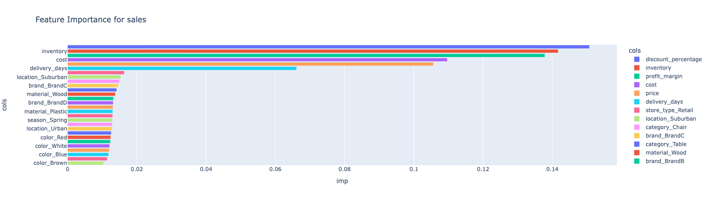
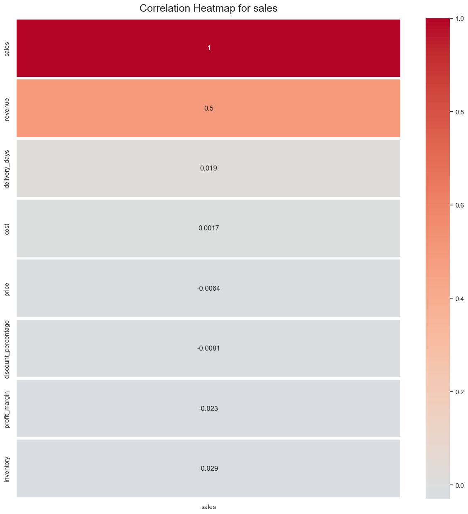

# Sales Analysis and Model Preparation for Random Forest

## Table of Contents
1. Introduction
2. Data Preparation for Random Forest Models
3. Feature Importance Analysis
4. Correlation Heatmap Analysis
5. Overall Insights and Recommendations
6. Next Steps

## 1. Introduction

This document provides a comprehensive analysis of sales data and outlines the process for preparing a Random Forest model. It covers data preparation techniques, feature importance analysis, and correlation analysis to derive insights for improving sales performance. The goal is to identify key factors influencing sales and provide actionable recommendations based on data-driven insights.

## 2. Data Preparation for Random Forest Models

When preparing data for a random forest model, we need to handle categorical variables and separate our features from the target variable. Here's an explanation of the process:

### 2.1 Identifying Categorical Columns

```python
categorical_cols = ["category", "season", "store_type", "brand", "color", "location", "material"]
```

We define a list of categorical columns in our dataset. These are features that contain non-numeric, discrete values.

### 2.2 Creating Dummy Variables

```python
if categorical_cols:
    dummies = pd.get_dummies(df[categorical_cols], drop_first=True)
```

We use pandas' `get_dummies()` function to convert categorical variables into binary (0 or 1) columns. This is called one-hot encoding. The `drop_first=True` parameter drops the first category for each feature to avoid the "dummy variable trap" (perfect multicollinearity).

### 2.3 Removing Original Categorical Columns

```python
df.drop(columns=categorical_cols, inplace=True)
```

We remove the original categorical columns from the dataframe as they're no longer needed after creating dummy variables.

### 2.4 Concatenating Dummy Variables

```python
df = pd.concat([df, dummies], axis=1)
```

We add the newly created dummy variables to our original dataframe.

### 2.5 Separating Features and Target Variable

```python
y_col = "sales"
x_cols = [col for col in df.columns if col != y_col]
```

Here, we're identifying our target variable (`y_col`) and our feature variables (`x_cols`):
- `y_col = "sales"`: This specifies that "sales" is our target variable (what we're trying to predict).
- `x_cols = [col for col in df.columns if col != y_col]`: This creates a list of all columns except for our target variable. These will be our features for the model.

### Why These Processes are Necessary

1. Random forests, like many machine learning algorithms, require numeric inputs.
2. Categorical variables often don't have a natural numeric ordering, so we can't simply label encode them (e.g., assigning 1, 2, 3 to categories).
3. One-hot encoding preserves the categorical nature of the variables without implying any ordinal relationship.
4. Dropping the first dummy variable for each category helps prevent multicollinearity issues.
5. Separating features from the target variable is crucial for supervised learning models like random forests. The model learns to predict the target variable based on the features.

By following these steps, we prepare our data in a format suitable for training a random forest model, handling both categorical variables and the separation of features and target.

## 3. Feature Importance Analysis for Sales



Based on the feature importance plot for sales prediction, we can infer several key insights:

### 3.1 Top Influential Factors

1. **Discount percentage**: By far the most important feature, suggesting that pricing strategies have a significant impact on sales.
2. **Inventory levels**: The second most important, indicating that stock availability strongly affects sales performance.
3. **Profit margin and cost**: Highly influential, highlighting the importance of pricing and cost management.

### 3.2 Operational Factors

- **Delivery days**: Moderate impact, suggesting that logistics and delivery speed play a role in sales, though not as crucial as pricing and inventory.

### 3.3 Location Impact

- **Suburban location**: Some importance, indicating that store location does affect sales to some degree.
- **Urban location**: Slightly lower impact than suburban.

### 3.4 Product Characteristics

- **Brand** (BrandC and BrandD shown) and **material** (Wood and Plastic): Some influence, but less than operational and pricing factors.
- **Product category** (Chair and Table shown): Some impact, though relatively minor compared to top factors.

### 3.5 Seasonal Effects

- **Spring season**: Present in the plot, suggesting some seasonal variation in sales, but not among the most critical factors.

### 3.6 Color Influence

- Various colors (Red, White, Blue, Brown) are present, but with relatively low importance. This suggests that while color may affect sales, it's not a primary driver compared to pricing and inventory factors.

### 3.7 Store Type

- **Retail store type**: Some influence on sales, though not as significant as the top factors.

### Key Takeaways

1. Focus on optimizing discount strategies and inventory management as these are the most influential factors for driving sales.
2. Pay attention to profit margins and costs, as they significantly impact sales performance.
3. Improve delivery times and consider location strategies, as these have moderate importance.
4. While product characteristics like brand, material, and color do matter, they are secondary to operational and pricing factors in driving sales.
5. Seasonal adjustments and store type considerations should be part of the strategy, but they're not the primary focus for maximizing sales impact.

## 4. Correlation Heatmap Analysis for Sales



This analysis is based on the provided correlation heatmap for sales.

### 4.1 Overview

The heatmap shows the correlation between sales and various factors that might influence them. The correlation coefficients range from -1 to 1, where:
- 1 indicates a perfect positive correlation
- 0 indicates no correlation
- -1 indicates a perfect negative correlation

### 4.2 Key Observations

1. **Sales to Revenue** (Correlation: 0.5)
   - Moderate positive correlation
   - Suggests that as sales increase, revenue tends to increase as well
   - The correlation is not perfect (1.0), indicating other factors also influence revenue

2. **Delivery Days** (Correlation: 0.019)
   - Very weak positive correlation
   - Suggests that delivery time has minimal impact on sales
   - Contrary to expectations, longer delivery times don't seem to significantly hurt sales

3. **Cost** (Correlation: 0.0017)
   - Negligible positive correlation
   - Implies that the cost of items has almost no direct relationship with sales volume

4. **Price** (Correlation: -0.0064)
   - Very weak negative correlation
   - Suggests that higher prices might slightly decrease sales, but the effect is minimal

5. **Discount Percentage** (Correlation: -0.0081)
   - Very weak negative correlation
   - Counterintuitively suggests that higher discounts might slightly decrease sales
   - This could indicate that discounts are applied to less popular items

6. **Profit Margin** (Correlation: -0.023)
   - Weak negative correlation
   - Indicates that items with higher profit margins tend to have slightly lower sales

7. **Inventory** (Correlation: -0.029)
   - Weak negative correlation
   - Suggests that higher inventory levels are associated with slightly lower sales
   - Could indicate overstocking of less popular items

### 4.3 Insights and Implications

1. **Revenue and Sales Alignment**: The moderate correlation between sales and revenue is expected but not perfect, suggesting other factors (like pricing strategy) influence revenue beyond just sales volume.

2. **Operational Factors**: Delivery time seems to have minimal impact on sales, challenging the assumption that faster delivery significantly boosts sales.

3. **Pricing Strategy**: 
   - The weak correlations of price and discount percentage with sales suggest that pricing strategies might be more complex than simply lowering prices or offering discounts.
   - The slightly negative correlation with discounts could indicate that discounts are being applied ineffectively or to the wrong products.

4. **Inventory Management**: The negative correlation between inventory and sales might indicate inefficiencies in stock management, possibly overstocking less popular items.

5. **Profit Margins**: The slight negative correlation with profit margins suggests a potential trade-off between margin and volume, but the effect is relatively small.

## 5. Overall Insights and Recommendations

Combining insights from the feature importance analysis and correlation heatmap, we can draw the following conclusions:

1. **Pricing and Discounts**: While the feature importance analysis suggests discounts are crucial, the correlation analysis shows a complex relationship. This indicates a need for a more nuanced approach to pricing and discount strategies.

2. **Inventory Management**: Both analyses highlight the importance of inventory, but with different implications. Optimizing inventory levels is critical, but it's not as simple as increasing stock across the board.

3. **Operational Factors**: Delivery days show moderate importance but minimal correlation with sales, suggesting that while they matter, other factors may be more impactful for improving sales performance.

4. **Product Characteristics**: Features like brand, material, and color have some importance but are secondary to operational and pricing factors. They should be considered for fine-tuning strategies rather than as primary drivers.

5. **Location and Seasonality**: These factors show some importance and should be part of the overall strategy, but they're not the most critical elements for driving sales.

## 6. Next Steps

Based on our analysis, here are the recommended next steps:

1. **Conduct In-depth Pricing Analysis**: Investigate the relationship between discounts, prices, and sales at a more granular level, possibly by product category or customer segment.

2. **Optimize Inventory Management**: Develop a more sophisticated inventory management system that considers sales trends, seasonality, and product characteristics.

3. **Refine Discount Strategies**: Reassess how and when discounts are applied, focusing on maximizing their impact on sales and revenue.

4. **Investigate Revenue Drivers**: Explore factors beyond sales volume that are influencing revenue, such as product mix or upselling strategies.

5. **Segment Analysis**: Perform separate analyses for different product categories, store types, or customer segments to uncover more specific insights.

6. **Predictive Modeling**: Use the prepared data to build and train the Random Forest model, then evaluate its performance in predicting sales.

7. **Continuous Monitoring**: Implement a system to regularly update and analyze these metrics, allowing for data-driven decision-making in real-time.

By following these steps and continuously refining our approach based on data-driven insights, we can work towards optimizing sales performance and overall business strategy.